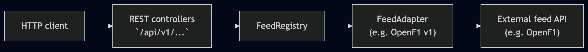

# WEE architecture

WEE (**Winning Events Ensured**) is a Spring Boot service that exposes a versioned HTTP API: **event listing** from external **feeds**, **bet placement**, and **settlement**, with **PostgreSQL** as the system of record for users and balances.

## High-level flow

## Layers

| Layer | Role |
|--------|------|
| **API** (`events.api`, `bets.api`) | HTTP mapping, validation, response DTOs; `X-User-Id` for external identity. |
| **Domain** (`events.domain`) | Stable in-process model: `Event`, `Market`, cursors, listing queries. Feed adapters map into this. |
| **Feed** (`events.feed`) | `FeedAdapter` contract, `FeedId` + version, `FeedRegistry` wiring. One implementation per feed version. |
| **Users / bets** (`users.persistence`, `bets.persistence`, `bets.service`) | JPA entities, repositories, transactional bet logic (balance updates, OpenF1 validation & settlement). |
| **Infrastructure** (`config`, feed-specific clients) | HTTP clients, beans, external DTOs, Flyway migrations. |

## Feed abstraction

- **`FeedId`** identifies a logical feed and a **version** (e.g. OpenF1 + `v1`) so breaking upstream changes can ship as a new adapter without touching others.
- **`FeedRegistry`** collects all `FeedAdapter` beans at startup and resolves by key.
- **`FeedAdapter.listEvents`** implements **cursor-based pagination** and applies **filters** (`eventType`, `year`, `country`) using feed-specific query parameters, then maps results to domain `Event` instances.

## Persistence (PostgreSQL)

- **`wee_user`**: Internal UUID primary key, unique **external** id (from `X-User-Id`), **balance in EUR**. New users are inserted on first bet with **100.00 EUR** default (enforced in DB + application on create). There is **no** REST endpoint to set balance arbitrarily; only placement and settlement modify it in normal operation.
- **`bet`**: Linked to `wee_user`, stores event id, market key, outcome id (OpenF1 driver number string), stake, odds at placement, status (`PENDING` / `WON` / `LOST`), payout, timestamps.

Schema is applied with **Flyway** (`db/migration`).

## OpenF1 and betting rules

- **Listing**: `OpenF1Client` loads sessions and drivers; `OpenF1V1FeedAdapter` maps them to WEE `Event` / `Market` / `MarketOutcome` (outcome id = driver number).
- **Placement**: `BetService` parses `openf1:v1:{session_key}`, checks drivers for the session, ensures the user row exists, locks the user row, and deducts stake.
- **Settlement**: For the same event id shape, `OpenF1Client.getSessionResult(session_key, position=1)` reads **historical** final classification from OpenF1 once published. If `outcome_id` equals the P1 **driver_number**, the user receives **stake × odds**; otherwise the bet is **lost**. Repeat settlement calls are **idempotent**.

## API conventions

- **User context**: `X-User-Id` is required for listing, placement, and settlement (missing/blank → `400` for those controllers).
- **Pagination** (events): cursor + `limit`; responses include `nextCursor` and `hasMore` where applicable.
- **Feed selection** (events): optional `feedId` and `feedVersion` query parameters; if omitted, default OpenF1 v1 is used.
- **Bet errors**: `BetsExceptionHandler` maps domain exceptions to HTTP status and JSON `ApiErrorBody`.

## Documentation

- **OpenAPI / Swagger UI**: SpringDoc at `/v3/api-docs` and `/swagger-ui.html` when the app is running (see README).
- **Operational config**: `application.properties` (port, datasource, feed base URLs).
